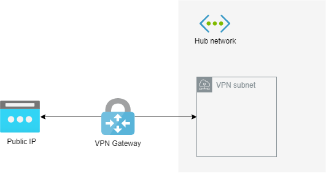

# infrastructure.azure.core.network.vpn

The `infrastructure.azure.core.network.vpn` repository stores the resource configuration files for
[Terraform](https://www.terraform.io/) to deploy a [VPN](https://docs.microsoft.com/en-us/azure/vpn-gateway/vpn-gateway-about-vpngateways)
to an Azure subscription so that users can connect to the different virtual networks in the Azure data centers from
their local networks in a secure fashion.

The Terraform configuration creates the following group of resources:

* A [public IP](https://docs.microsoft.com/en-us/azure/virtual-network/public-ip-addresses) used as
  the public entrypoint for the VPN.
* The [virtual network gateway](https://docs.microsoft.com/en-us/azure/vpn-gateway/vpn-gateway-about-vpngateways)
* [Diagnostic settings](https://docs.microsoft.com/en-us/azure/azure-monitor/platform/diagnostic-settings)
  for monitoring:
  * The public IP activity
  * The gateway
* The [local gateway](https://docs.microsoft.com/en-us/azure/vpn-gateway/vpn-gateway-howto-site-to-site-resource-manager-portal#LocalNetworkGateway)
  that represents the on-premises location for routing purposes.

All resources are named after the type of resource they are, e.g. `-rg` for the resource group, prefixed with a standard prefix. The prefix consists of
a combination of the Environment, e.g. Production, the Azure location,
e.g. Australia East, and a category, in this case `nwk-vpn`:

    ${var.environment_short}-${var.location_short}-tf-${var.category}

The default values for each of the variables are defined in the `variables.tf` file

* `environment_short` = `p` - For production
* `location_short` = `aue` - For the Australia East region
* `category` = `nwk-vpn`

Which leads to a prefix of: `p-aue-tf-nwk-vpn`

By default the following tags are added:

* **category** - Set to the category. Defaults to `nwk-vpn`
* **environment** - Set to the environment. Defaults to `production`
* **location** - The Azure region in which the resources are created. Defaults to `australiaeast`
* **source** - The commit ID of the current commit
* **version** - The version of the resources

Additional tags can be added by setting the `tags` variable as defined in the `variables.tf` file.

## Variables

* **category** - The name of the category that all the resources are running in. Defaults to `nwk-vpn`
* **environment** - The name of the environment that all the resources are running in. Defaults to `production`
* **local_network_address_space** - The address space of the local network that is connected to the VPN,
  e.g. `192.168.0.0/16`
* **local_network_gateway_address** - The IP address of the local network through which the VPN connects.
* **local_network_shared_key** - The key that is shared between the two ends of the VPN for authorization.
* **location** - The full name of the Azure region in which the resources should be created. Defaults to `australiaeast`
* **meta_source** - The commit ID of the current commit from which the plan is being created. Used to tag the resources.
* **meta_version** - The version of the infrastructure as it is being generated. Used to tag the resources.
* **subscription_production** - The subscription ID of the production subscription. Used to find the log analytics resources.
* **subscription_test** - The subscription ID of the test subscription.
* **tags** - Tags to apply to all resources created.

## Use

In order to run the Terraform configuration in this repository you need to have an Azure subscription and be
[connected to that subscription](https://www.terraform.io/docs/providers/azurerm/index.html).

Once you are signed in run the Terraform [plan](https://www.terraform.io/docs/commands/plan.html) command to preview the
changes that will be made.

    tf plan -var subscription_production=<SUBSCRIPTION_ID> -var subscription_test=<SUBSCRIPTION_ID> -var meta_source=<GIT_COMMIT_HASH> -var meta_version=<VERSION> -var local_network_address_space=<SITE_ADDRESS_SPACE> -var local_network_gateway_address=<SITE_PUBLIC_IP> -var local_network_shared_key=<SHARED_KEY> -out ./build/tf/plan

When you are happy with the plan execute the plan with the Terraform [apply](https://www.terraform.io/docs/commands/apply.html) command.

    tf apply ./build/tf/plan
